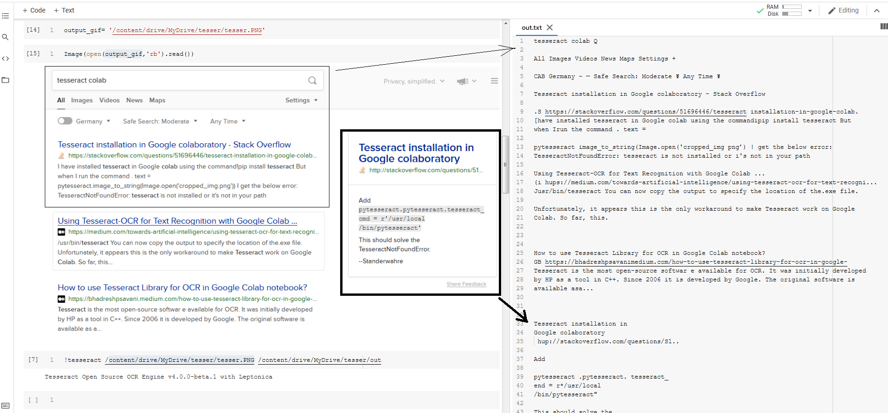
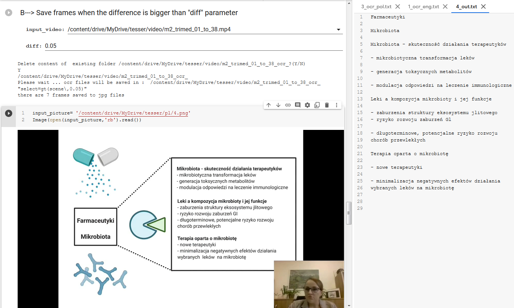
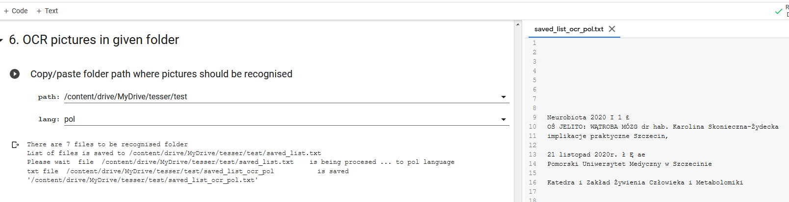

## Project Name Tesseract 4.0x+ with LSTM


> <p>Tesseract 4.0x+ added a new OCR engine based on LSTM neural networks.<br> That feature and a lot impleented in previous releases made my attention. Number of languages which are recognised( ~60) is also impresive.<br>

For Latin-based languages, the existing model data provided has been trained on about 400000 textlines spanning about 4500 fonts.<br> For other scripts, not so many fonts are available, but they have still been trained on a similar number of textlines. eg. Latin ~4500 fonts, Devanagari ~50 fonts, Kannada 15.<br>


Library is installed from : [Tesseract ](https://github.com/tesseract-ocr/tessdata_fast) .<br>
<br>


### Results: on the left side there is a picture on the right opned output text file after ocr processing


---

### Additional funcions:

To retrieve text from video files ffmpeg was used to split file to frames 
with given diffrence factor when text presentation was changed.
Once having set of pictures in directory they were OCRed in a batch to text file.

---


---



## Python  make life easier with PDF documents


> <p>There are couple of useful libraries when you want to take out text only or text tables and their position on the page<br>
Simplest is PyPDF2.
another pdfminer
and last PyMuPDF  which I like most all were suggested by [DIDA ](https://dida.do/de/blog/text-aus-pdf-dateien-extrahieren ) team in their tools review. <br>
PyPDF2 and pdfminer were installed without problems though PyMuPDF was really stubborn especially if you ws not willing to do mess in your python environment uner Ubuntu 18. 
As usual with help docker arrived and one of the python slim images as a base. Content of Dockerfile_pdf_tools file below

```
FROM python:3.9.7-slim-bullseye 

# Image descriptions
LABEL maintainer="SL"
LABEL version="0.2"
LABEL description = "pdf-tools"

# Specifies the working directory
WORKDIR /data


RUN pip install pymupdf PyPDF2 pdfminer
```
then image was build  and executed  with excelent result

```
docker build  -f Dockerfile_pdf_tools -t processpdf:02
```
/home/lubuntu/process_pdf was my local folder where everything was tested

```
docker container run -it --name pdf_extracting  -v /home/lubuntu/process_pdf:/data processpdf:02 bash
```
Contentent of pymupdf.py:


```
import fitz
doc = fitz.open("Text aus PDF-Dateien extrahieren dida Machine Learning.pdf")
page = doc[0]
text = page.getText("text")
print(text)
```
```
root@7f0cbc69d03b:/data# python pymupdf.py
Deprecation: 'getText' removed from class 'Page' after v1.19 - use 'get_text'.
Home › Blog › Text aus PDF�Dateien extrahieren
Dieser Blogartikel wurde teilweise mit Hilfe von DeepL (deepl.com) übersetzt.
Text aus PDF-Dateien extrahieren
Text Extraction
Natural Language Processing
Pdf Processing
Geschrieben von Lovis Schmidt
Veröffentlicht am 17. August 2020
In NLP�Projekten hat man es oft mit PDFs als Ausgangsdokumenten zu tun.
Manchmal enthalten die PDFs bereits zugrundeliegende Textinformationen,
wodurch es möglich ist, Text ohne den Einsatz von OCR�Werkzeugen zu
extrahieren. Im Folgenden möchte ich einige Open-Source-PDF�Werkzeuge
vorstellen, die in Python verfügbar sind und mit denen sich Text extrahieren lässt.
Ich werde ihre Eigenschaften vergleichen und auf ihre jeweiligen Vor- und
Nachteile hinweisen.
Die Tools heißen  PyPDF2 ,  pdfminer  und  PyMuPDF .
Text aus PDF-Dateien extrahieren | dida Machine Learning
https://dida.do/de/blog/text-aus-pdf-dateien-extrahieren
1 of 14
17/02/2022, 12:01

root@7f0cbc69d03b:/data# 
```

### Technologies
* Python, 
* LSTM
* OCR


### Setup
Easiest way is to install/update libraries accordnig to install secion in notebook


### Contact
Created by: _len.sla_

